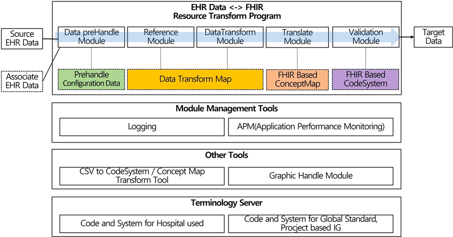
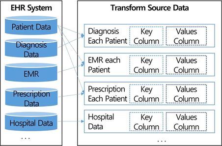

### FHIR TWEAKS(Transform data With Easy And Kind Services)
#### Data Transform Tutorial Page

The data transformation tool is composed of the following features. Therefore, I have structured the tutorial according to the sequence of modules through which the data passes.
 



##### 1. How to Use
The user simply needs to configure the Transform Map for the target FHIR Resource they wish to transform and insert the Source data. 
They will then receive a completed set of FHIR Resources as a Bundle.

If you want to see how this works, please refer to the paper below.
~~[Research Page](not)~~

##### 2. Detail
##### 2.1. Source Data
Many programs that require the transformation of EMR systems and other healthcare information have their own unique structures. The process of transforming these into the FHIR Data structure requires distinguishing the unique identifiers of each data element to effectively utilize References, a task that can be relatively complex.

To address this challenge, each healthcare data set is defined to utilize the key configuration (composite or single keys) existing within its own system. Consequently, instead of generating separate keys for FHIR transformation, data can be transmitted using the native column names, structure, and row count of the EMR system, as illustrated in the sample data below.

For example, in the case of diagnoses categorized as primary and secondary conditions, the system can insert them into a single Condition Resource as an array without needing to combine them into a single row or create additional keys to define the relationship between Patient and Encounter. The values used in the local healthcare system can be directly requested without modification.

For detailed examples, please refer to the samplesource folder under the tutorial/transform directory. This sample data is an example of data transformed from the actual structure of an EMR system into synthetic data.


##### 2.2. Write Transform Map 
Select the FHIR resource that you want to transform and create a Transform Map for the selected FHIR resource. Refer to the contents of the samplemap folder within tutorial/transform for sample data.

The detailed understanding of the Transform Map is as follows:
1) metadata
 ```
 * metadata
 * mapping
  * error_policy = exception
  * cacheKey = inst_cd, seq_no
  * mergeKey = -
 ```
- Define the pattern for managing errors and Reference Keys that occur when transforming data.
- For error handling, define how the program should respond based on the type of error that occurs.
  You can choose to ignore errors by adding ignore, or trigger an error by adding exception.
- The Reference Key (Cache Key) is a value that allows the server to understand the key of the Source data.
  You should input a key that matches the unique structure of the data that the hospital has. This key is used when referencing other resources.
- In the case of a MergeKey, define which Single Rows should be combined into a single FHIR Resource when you want to convert multiple Source Rows into one.
  By entering this, the process of converting the resource will recognize multiple rows as a single row and convert them accordingly.

```
* referenceData
   * referenceResource
    * target = Organization
    * depend_policy = exception
    * inst_id -> hospital_id :: -
```
- The referenceData section is used when referencing other resources.
- When transmitting patient information or other hospital data in bulk, identify the order of the references to prioritize the most important ones.
- For example, in the sample above, during the process of creating a Patient, the inst_id value from the Source Data is used to reference an Organization Resource that was previously created with a unique hospital_id.

2) Transform
```
# Sample Data
* resourceType='DiagnosticReport'
* id =(KEY)MERGE('DR','.', Organization_id, '.', seq_no)
* meta
 * (profile).profile
  * 'http://www.hl7korea.or.kr/fhir/krcore/StructureDefinition/krcore-diagnosticreport-diagnostic-imaging'
* identifier
 * system=Organization_id
 * value=MERGE('DR','.', Organization_id, '.', seq_no)
* status=instp_sts
* (category).category
 * (coding).coding
  * system='http://terminology.hl7.org/CodeSystem/v2-0074'
  * code=insp_div
```

- The Resource Type at the top defines which Resource the data will be transformed into.
- The rows below then perform actions based on their respective meanings.
- In the case of {resourceName}_id, it uses the referenceData explained in the meta section above to retrieve the Id of a previously created Resource.
- For example, for id, it is defined to use DR + '.' + Organization_id + '.' + seq_no combined as the id.
- If the data is in an array structure and multiple rows from the source have been merged into a single row, it is combined into a single line using a pattern like (sourceName).
  For example, the structure below illustrates this.
```
      # Source Data for Transforming Condition
      {
            "medi_bgng_ymd": "20231212",
            "diagcc_div": "encounter-diagnosis",
            "subj_id": "prol000715",
            "rcpt_no": "1012002366438200001245",
            "seq_no": "012202308211068996982",
            "pat_id": "23664382",
            "diag_nm": "Cervical tooth abrasion",
            "medi_end_ymd": "20230821",
            "diag_txt": null,
            "resource_type": "Condition",
            "map_type": "CMC.Condition",
            "dr_id": "92680071",
            "diag_cd_div": "KCD-8",
            "diag_cd": "K0319.001.00",
            "diag_ymd": "20231212"
        },
        {
            "medi_bgng_ymd": "20231212",
            "diagcc_div": "encounter-diagnosis",
            "subj_id": "prol000695",
            "rcpt_no": "1012002366438200001246",
            "seq_no": "012202312121099866981",
            "pat_id": "23664382",
            "diag_nm": "Splenic cyst",
            "medi_end_ymd": "20231212",
            "diag_txt": null,
            "resource_type": "Condition",
            "map_type": "CMC.Condition",
            "dr_id": "92680071",
            "diag_cd_div": "KCD-8",
            "diag_cd": "D734.000.02",
            "diag_ymd": "20231212"
        }
```
When defining a TransformMap as shown below to perform the transformation
```
 * metadata
 * mapping
  * error_policy = exception
  * cacheKey = subj_id, rcpt_no, seq_no, pat_id, dr_id
  * mergeKey = subj_id, rcpt_no, seq_no, pat_id, dr_id   
  ...
* (category).category
 * (diag_cd).diag_cd
  * system='KCD-8'
  * code=insp_div  
```
When the mergeKey is used as described, if the prescription in the EMR system has the same date, the same patient, the same unique ID, and the same visit number, it is considered to have occurred during the same consultation, so it is merged into a single Condition. (If merging is not needed, you can set the mergeKey to -).
Then result like that.

```
 { "resourceType":"Condition",
  ...
 ,"code": {
    "coding": [ {
      "system": "https://kostat.go.kr/Codesystem/kcd-8",
      "code": "K0319.001.00",
      "display": "Cervical tooth abrasion"
    },{
      "system": "https://kostat.go.kr/Codesystem/kcd-8",
      "code": "D734.000.02",
      "display": "Splenic cyst"
    }]
  }
```